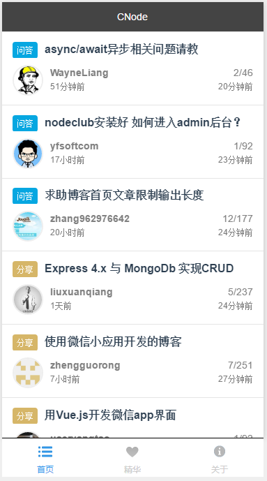
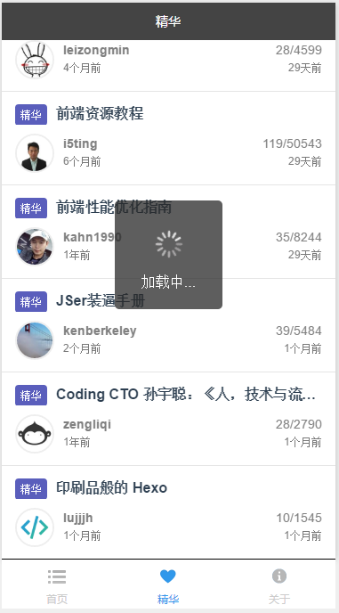
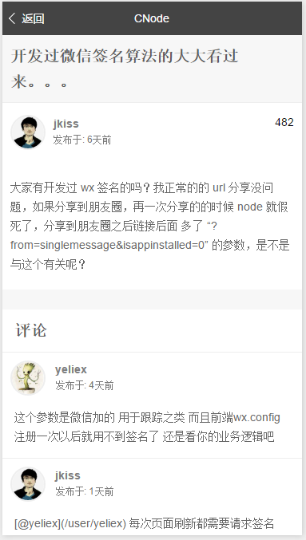

# 微信小程序 - CNode

##

## 说明

> 官方文档：https://mp.weixin.qq.com/debug/wxadoc/dev/
>
> CNodeAPI官方文档：https://cnodejs.org/api
> 
> 效果：全部内容页、精华分类页和详情页(详情页内容部分由于不支持html标签所以排版有问题)、上拉加载更多

## Demo 预览

  
  
  
  

